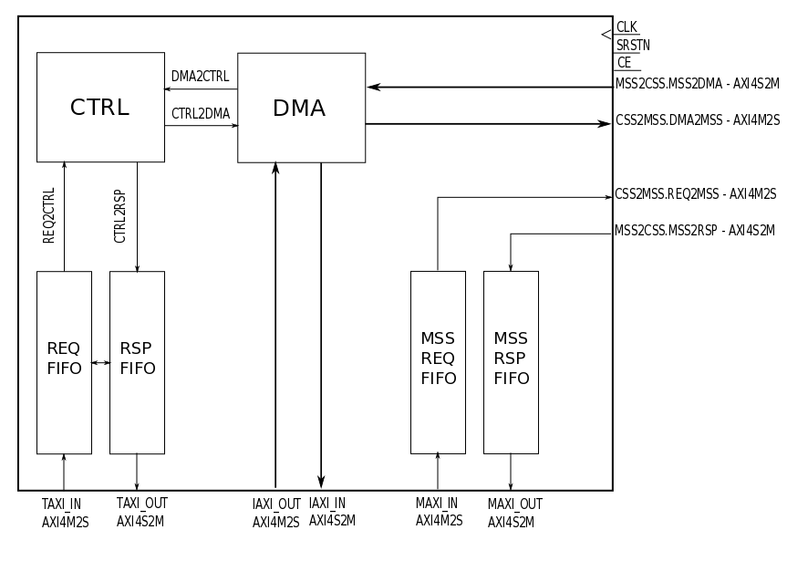
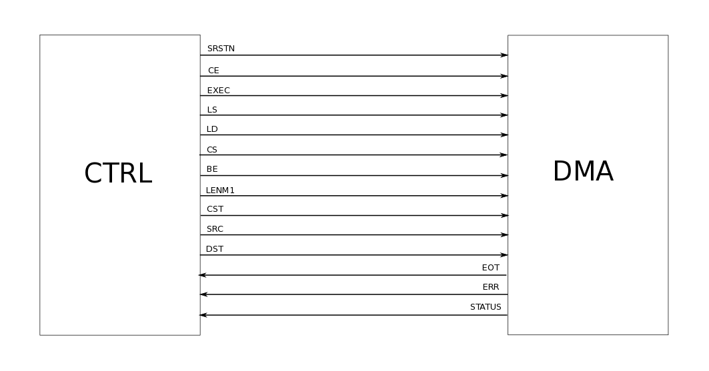
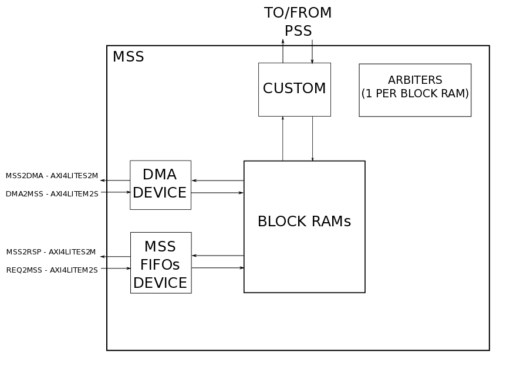
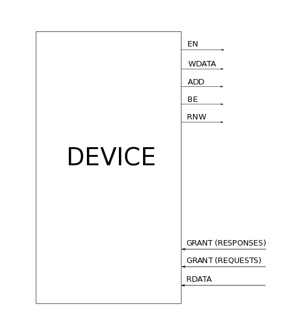

# Design of a Digital Signal Processor for wireless communications
Student: Christian PALMIERO  
Academic supervisor: Renaud PACALET  
Semester: Spring 2017 - EURECOM, Campus SophiaTech

----
## Abstract
[Embb](http://embb.telecom-paristech.fr/) is a Digital Signal Processor (DSP) designed by Telecom ParisTech researchers and dedicated to Software Defined Radio (SDR) applications. It is a collection of DSP units, each dedicated to a family of DSP algorithms (vector processing, Fourier transforms, interleaving...) interconnected around a communication network and controlled by a general-purpose processor.  
In the previous Embb version the communication between DSP units makes use of the standard Virtual Component Interface (VCI) point-to-point communication protocol. The goal of this project is to rework the communication infrastructure in order to use the more recent AMBA AXI4 protocol.
## List of contents
1. [Introduction](#intro)  
2. [Control Sub-System](#css)  
2.1. [Requests FIFO](#req)  
2.2. [Requests FIFO Functional Validation](#reqs)  
2.3. [Responses FIFO](#rsp)  
2.4. [Responses FIFO Functional Validation](#rsps)  
2.5. [TAXI Interface Functional Validation](#ctrls)  
2.6. [MSS Requests FIFO](#mssreq)  
2.7. [MSS Requests FIFO Functional Validation](#mssreqs)  
2.8. [MSS Responses FIFO](#mssrsp)  
2.9. [MSS Responses FIFO Functional Validation](#mssrsps)  
3. [DMA](#dma)  
3.1. [DMA - CTRL Interface](#dma-ctrl)  
3.2. [CSS - MSS Interface](#css-mss)  
3.2.1. [MSS Arbiter](#arb)  
3.2.2. [MSS Device](#dev)  
4. [References](#ref)  

## Introduction
All DSP units of Embb share the same generic hardware architecture, the DU Shell, which comprises 3 components:  
* Processing Sub-System (PSS), a custom processing unit;
* Memory Sub-System (MSS), a local storage facility;
* Control Sub-System (CSS), responsible for interfacing with the host system and for acting as a controller of the whole DSP unit.

The CSS is a generic module and is composed of several configuration registers (CTRL), two FIFO queues dedicated to the communication between the host system and CTRL, two FIFO queues dedicated to the communication between the host system and the MSS, an optional Direct Memory Access engine (DMA).  
This project mainly focuses on the rework of the CSS communication infrastructure. Furthermore, it defines new functional specifications for the execution of DMA data transfers inside MSS or between MSS and other memory locations in the
whole system.  
Therefore, the first chapter of the current report describes in details the new CSS architecture; the second chapter specifies the new interface between DMA and MSS.
## Chapter 1 - Control Sub-System

CSS is the gateway to the host system and embeds the following sub-components:
* A control unit containing a set of control and status registers (CTRL);
* An optional Direct Memory Access engine (DMA);
* AXI4-Lite requests-responses FIFOs for accessing the CTRL registers;
* AXI4-Lite requests-responses FIFOs for accessing the MSS.

Assuming that DMA is present, CSS has three AXI4-Lite interfaces:
1. The host system is the master and the CTRL is the slave (**TAXI**);
2. The host system is the master and the MSS is the slave (**MAXI**);
3. The DMA is the master and the MSS is the slave (**IAXI**).

The first interface is used for reading from and for writing into the control and status registers, that is, to drive the DSP unit and to get information about its current state.  
The second interface is used for uploading data samples into MSS and for downloading processing results.  
The third interface is used for programming the DMA, that can perform data transfers between MSS and other memory banks in the system, or move data inside MSS, without involving the main CPU.

### Requests FIFO

The Requests FIFO is located between the host system and the internals of CSS.  
The **clock** source, the **synchronous active low reset** and the **chip enable** are global signals.  
**REQ_IN**, sent from the host system, is an AXI4-Lite request, composed of three channels, the write address channel, the write data channel and the read address channel. Due to the fact that the CTRL registers do not support simultaneous read and write operations, in the FIFO there is only one spot to save either the AWADDR or the ARADDR. These two signals are, therefore, shared in order to save power and area.  
**AWREADY**, **WREADY** and **ARREADY** are three AXI4 ready signals that are sent back to the host system.
They are asserted by default and are de-asserted in the following scenarios:
* The FIFO is full: all the three ready signals are de-asserted;
* The master is willing to perform a write operation but it does NOT provide at the same time both the AWADDR and the AWDATA:
if AWVALID is equal to '1' and WVALID is equal to '0', AWREADY is de-asserted; if WVALID is equal to '1' and AWVALID is equal to '0', WREADY is de-asserted;
* The master is willing to perform both a read and a write operation simultaneously but there is only one free spot in the FIFO: the write request is stored into the FIFO free spot, the read request is stored into a temporary buffer (write requests have higher priority) and all the three ready signals are de-asserted until the buffer is empty and there is at least one free spot in the FIFO.  

On the local DSP unit side, the first received and not yet transmitted request, if any, is output on **REQ2CTRL**, a signal type composed of enable, read/not write, byte enable, address and write data. When the **ACK** is received from CTRL, the output request is removed from the FIFO and the next request, if any, is output on REQ2CTRL.  
In case there is an erroneous request for CTRL, the **ERR** signal, that goes to the Responses FIFO, is asserted, so that the erroneous request is not forwarded to CTRL and an erroneous status response is immediately stored in the Responses FIFO.  
**ACK_RSP** is the number of free places in Responses FIFO. Outgoing requests are acknowledged only if the number of AXI requests acknowledged by CTRL and for which a response has not yet been stored in the Responses FIFO is less than ACK_RSP. This guarantees that there is enough space in Responses FIFO to store the corresponding response.

#### Requests FIFO Functional Validation
The Requests FIFO design has been validated through a simulation environment that emulates the following scenarios:
* The host system issues a sequence of AXI write requests -> useful to analyze the behavior of the write address and of the write data channels;
* The host system issues a sequence of AXI read requests -> useful to analyze the behavior of the read address channel;
* The host system issues a sequence of simultaneous AXI write and read requests -> useful to analyze the behavior of the temporary buffer;
* The host system issues a sequence of AXI write requests but the AWWALID and the WVALID signals are not contemporary asserted -> useful to analyze the behavior of the READY signals.

### Responses FIFO

The Responses FIFO is located between the internals of CSS and the host system.  
The **clock** source, the **synchronous active low reset** and the **chip enable** are global signals.  
**CTRL2RSP** is the incoming response from CTRL and contains the acknowledge, the out-of-range signal and the read data.  
**ERR**, **EN** and **RNW** are three signals coming from the Requests FIFO: they correspond, respectively, to an indication that an erroneous status response should be stored into the FIFO, and to the enable and the read not write of the current outgoing request to CTRL (the response comes in the same clock cycle).  
Due to the fact that the CTRL registers do not support simultaneous read and write operations, in the FIFO there is only one spot to save either the RRESP or the BRESP. These two signals are, therefore, shared in order to save power and area.  
On the host system side, the first received and not yet transmitted response, if any, is output on **RSP_OUT**, an AXI4-Lite response, composed of two channels, the write response and the read data.
When acknowledged (**BREADY** or **RREADY** input asserted), the current response is removed from the FIFO and the next response, if any, is output on RSP_OUT.  
The most important criteria for this design is the delay between internal registers and RSP_OUT. As a consequence, RSP_OUT is directly wired to the first stage of the FIFO. The incoming responses are stored at the first available location starting from this same stage. To avoid long combinatorial paths, the ACK signal does not depend on BREADY or RREADY.

#### Responses FIFO Functional Validation
The Responses FIFO design has been validated through a simulation environment that emulates the following scenarios:
* A sequence of read responses is received from CTRL but both BREADY and RREADY are de-asserted -> useful to see if the responses are not forwarded to the host system;
* A sequence of read responses is received from CTRL and RREADY is asserted -> useful to see if the responses are forwarded to the host system;
* A sequence of read responses is received from CTRL but only BREADY is asserted -> useful to see if the responses are not forwarded to the host system;
* A sequence of write responses is received from CTRL but both BREADY and RREADY are de-asserted -> useful to see if the responses are not forwarded to the host system;
* A sequence of write responses is received from CTRL but only RREADY is asserted -> useful to see if the responses are not forwarded to the host system;
* A sequence of write responses is received from CTRL and BREADY is asserted -> useful to see if the responses are forwarded to the host system;
* A sequence of erroneous responses is stored in the FIFO and both BREADY and RREADY are asserted -> useful to analyze the erroneous responses.

#### TAXI Interface Functional Validation
The TAXI AXI4-Lite interface where the host system is the master and the CTRL is the slave has been validated through a simulation environment that emulates the following scenarios:
* A sequence of write operations are issued towards the CTRL;
* A sequence of read operations are issued towards the CTRL in order to retrieve the previously written data.

### <a name="mssreq">MSS Requests FIFO

The MSS Requests FIFO is located between the MSS and the host system.  
The **clock** source, the **synchronous active low reset** and the **chip enable** are global signals.  
**REQ_IN**, sent from the host system, is an AXI4-Lite request, composed of three channels, the write address channel, the write data channel and the read address channel.
**HST_AWREADY**, **HST_WREADY** and **HST_ARREADY** are three AXI4 ready signals that are sent back to the host system.
They are asserted by default and are de-asserted in the following scenarios:
* The FIFO is full: all the three ready signals are de-asserted;
* The master is willing to perform a write operation but it does NOT provide at the same time both the AWADDR and the AWDATA:
if AWVALID is equal to '1' and WVALID is equal to '0', AWREADY is de-asserted; if WVALID is equal to '1' and AWVALID is equal to '0', WREADY is de-asserted.

On the MSS side, the first received and not yet transmitted request, if any, is output on **REQ2MSS**, an AXI4-Lite request. As soon as the MSS handshakes the FIFO through **MSS_AWREADY**, **MSS_WREADY** and **MSS_ARREADY**, the output request is removed from the FIFO and the next request, if any, is output on REQ2MSS.  

#### <a name="mssreqs">MSS Requests FIFO Functional Validation
The Requests FIFO design has been validated through a simulation environment that emulates the following scenarios:
* The host system issues a sequence of AXI write requests -> useful to analyze the behavior of the write address and of the write data channels;
* The host system issues a sequence of AXI read requests -> useful to analyze the behavior of the read address channel;
* The host system issues a sequence of simultaneous AXI write and read requests -> useful to analyze the behavior of the write address, the write data and the read address channels;
* The host system issues a sequence of AXI write requests but the AWWALID and the WVALID signals are not contemporary asserted -> useful to analyze the behavior of the READY signals.

### <a name="mssrsp">MSS Responses FIFO

The MSS Responses FIFO is located between the MSS and the host system.  
The **clock** source, the **synchronous active low reset** and the **chip enable** are global signals.  
**MSS2RSP** is an AXI4-Lite request coming from the MSS. As soon as the FIFO handshakes the MSS through **MSS_BREADY** and **MSS_RREADY**, the incoming response stored into the FIFO.  
On the host system side, the first received and not yet transmitted response, if any, is output on **RSP_OUT**, an AXI4-Lite response.
When acknowledged (**HST_BREADY** or **HST_RREADY** input asserted), the current response is removed from the FIFO and the next response, if any, is output on RSP_OUT.  
The most important criteria for this design is the delay between internal registers and RSP_OUT. As a consequence, RSP_OUT is directly wired to the first stage of the FIFO. The incoming responses are stored at the first available location starting from this same stage. To avoid long combinatorial paths, the ACK signal does not depend on HST_BREADY or HST_RREADY.

#### <a name="mssrsps">MSS Responses FIFO Functional Validation
The Responses FIFO design has been validated through a simulation environment that emulates the following scenarios:
* A sequence of read responses is received from CTRL but both HST_BREADY and HST_RREADY are de-asserted  
-> useful to see if the responses are not forwarded to the host system;
* A sequence of read responses is received from CTRL and HST_RREADY is asserted -> useful to see if the responses are forwarded to the host system;
* A sequence of read responses is received from CTRL but only HST_BREADY is asserted -> useful to see if the responses are not forwarded to the host system;
* A sequence of write responses is received from CTRL but both HST_BREADY and HST_RREADY are de-asserted -> useful to see if the responses are not forwarded to the host system;
* A sequence of write responses is received from CTRL but only HST_RREADY is asserted -> useful to see if the responses are not forwarded to the host system;
* A sequence of write responses is received from CTRL and HST_BREADY is asserted -> useful to see if the responses are forwarded to the host system;
* A sequence of erroneous responses is stored in the FIFO and both HST_BREADY and HST_RREADY are asserted -> useful to analyze the erroneous responses.

## <a name="dma">Chapter 2 - Direct Memory Access engine
When present in a DSP unit, DMA allows efficient data transfers inside MSS or between MSS and other memory-mapped areas in the system’s addresses space. DMA is a single-channel, 64-bits wide engine. Its main use is to upload data to process in MSS and download processing results. DMA can also be used to transfer directly between two external memory locations.

### <a name="dma-ctrl">DMA - CTRL Interface

In order to perform a DMA transfer, a set of parameters are written in the 3 CTRL registers dedicated to the DMA: dcfg, dcst and dadd. These parameters are, then, forwarded to DMA through the following interface:
* **SRSTN**: Synchronous active low reset;
* **CE**: Chip enable;
* **EXEC**: Start DMA transfer;
* **LS**: Local source flag (when set, the source of the DMA transfer is MSS and the source address is a byte offset relative to the base address of the DSP unit; when unset,
the source is an external memory location and the
source address is a system byte address);
* **LD**: Local destination flag (same as source);
* **CS**: Constant source data flag (when set, the source data is the content of the CST register);
* **BE**: Write byte enable;
* **LENM1**: DMA transfer length minus one (in bytes). It is a multiple of 8 bytes;
* **CST**: Constant write data (constant value used as source data of the transfer when **CS**=1);
* **SRC**: Source address. It is a multiple of 8 bytes;
* **DST**: Destination address. It is a multiple of 8 bytes.

As soon as the DMA transfer is completed, the DMA sets the **EOT** (End Of Transfer) flag. In case an error occurred, the DMA also sets the **ERR** flag and stores in **STATUS** an error code corresponding to the occurred error.

### <a name="css-mss">CSS - MSS Interface

The CSS communicates with the MSS through two interfaces:
* DMA - MSS: it is an AXI4-Lite interface, where DMA is the master and MSS is the slave;
* MSS FIFOs - MSS: it is an AXI4-Lite interface, where MSS FIFOs  are the master and MSS is the slave.

In order to handle requests from PSS, DMA and MSS Requests FIFO, MSS embeds a set of arbiters and a set of devices whose functions are described in the next two sections.

#### <a name="arb">MSS Arbiter
Each MSS embeds one arbiter per block RAM. The arbiter collects all the requests addressed to a single block RAM, enables only one client according to a certain priority and sets the priority among read and write operations. Whatever the memory word width is (8 bits, 16 bits, 32 bits..), the arbiter either grants the whole memory word or nothing.  

#### <a name="dev">MSS Device
Each MSS embeds one special device handling requests/responses from/to DMA, one special device handling requests/responses from/to MSS FIFOs and one custom device handling requests/responses from/to PSS.  
Both the DMA device and the MSS FIFOs device have the same behavior.

Their main functions are:  
* handling the translation from AXI4-Lite protocol into a custom protocol and vice versa;  
* handling read and write operations.

## <a name="ref">References
[1] Embb documentation - Telecom ParisTech - March 1, 2017  
[2] AMBA® AXI™ and ACE™ Protocol Specification AXI3,
AXI4, and AXI4-Lite ACE and ACE-Lite - ARM
